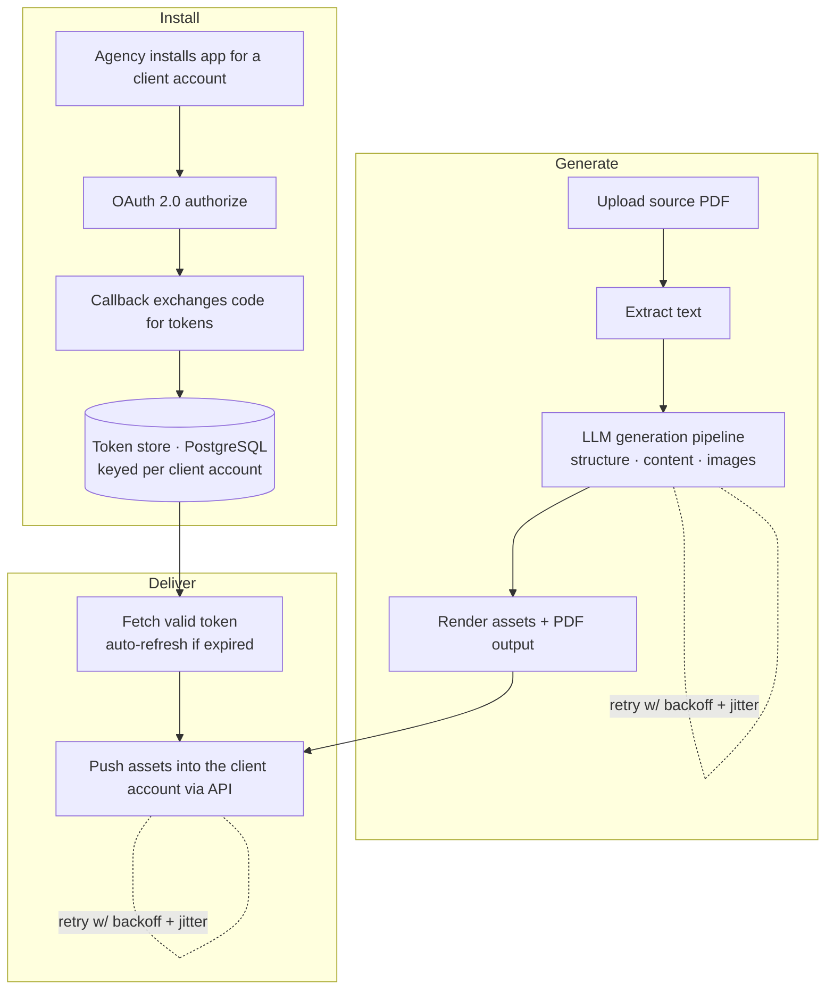

# AI Content Generation Platform — Case Study

> **Private client work.** This is a documentation-only case study. The source code is
> confidential and owned by the client, so it is not published here. Everything below
> describes the architecture and my engineering work without exposing client code, data,
> or identifiers. Happy to walk through it in more detail in an interview.

A **multi-tenant SaaS tool** built for a marketing agency that operates on the GoHighLevel
platform. The agency was manually producing client content by hand. This tool takes the agency's
source material, uses AI to generate the full structure and content, and pushes the
finished assets straight into each client's account — no manual building.

**Role:** Sole developer (design, build, deploy) &nbsp;•&nbsp; **Stack:** Node.js · Express · OpenAI · PostgreSQL · OAuth 2.0

---

## What it does

- An agency installs the app once per client account through a secure **OAuth 2.0** flow.
- A user uploads source material (e.g. a PDF). The app **extracts the text**, then uses an
  **LLM pipeline** to generate structured, ready-to-use content — including images.
- The generated assets are rendered (including **PDF output**) and **pushed automatically
  into the correct client account** via API.
- Because it's **multi-tenant**, every client account has its own securely stored
  credentials, and one install never touches another's data.

---

## Architecture

---

## Engineering highlights

These are the parts I'm most proud of — and the reason this project is more than "calling an API":

- **Multi-tenant OAuth 2.0.** Full authorization-code flow with CSRF protection (signed,
  expiring `state` values). Each client account's access + refresh tokens are stored
  separately and **refreshed automatically** when expired, including refresh-token rotation.
- **Persistent token store that survives redeploys.** Postgres-backed (with a local-file
  fallback for development), so installs don't break when the server redeploys — a real
  problem on cloud free tiers that I designed around.
- **Resilient AI/API calls.** A custom retry layer with **exponential backoff + jitter**
  that distinguishes *transient* failures (429/503/timeouts → retry) from *permanent* ones
  (400/401 → fail fast), so the generation pipeline doesn't fall over under rate limits.
- **Document pipeline.** PDF text extraction in, structured AI generation in the middle,
  rendered assets and generated PDFs out.
- **Production deployment** with environment-based configuration and secret management.

---

## Tech stack

| Layer | Tools |
|---|---|
| **Runtime** | Node.js, Express |
| **AI** | OpenAI API (structured content + image generation) |
| **Data** | PostgreSQL (per-tenant token store) |
| **Integration** | OAuth 2.0, REST APIs, GoHighLevel marketplace app |
| **Documents** | PDF parsing + PDF generation |
| **Deployment** | Cloud-hosted, environment-based config |

---

## Why there's no code here

The tool is in active use by the client's business and the code is their intellectual
property. Publishing it would be a breach of that trust — so this repo intentionally
contains documentation only. I can demonstrate the architecture, walk through specific
design decisions, or show a sanitized screen recording on request.

---

Case study by **Ray Salcedo** — [portfolio](https://rayysalcedo.github.io/portfolio/)
